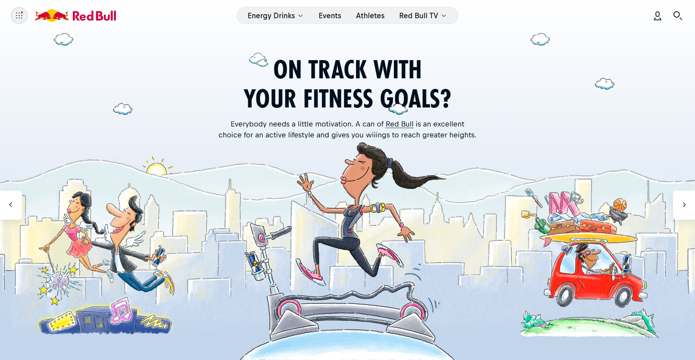
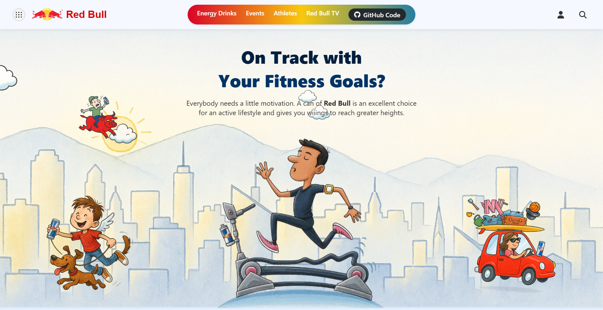

# 🥫 Red Bull-Themed Landing Page

A creatively reimagined landing page inspired by the official Red Bull website, built using **HTML, CSS, and Vanilla JavaScript**. While it's not a clone, the layout pays homage to the original design—with my own custom visuals, easter eggs, and animations to give it a fun, personalized twist.

## 🔗 Live Preview

🌐 [Live Site](https://apoorvdarshan.github.io/redbull)

## 💻 GitHub Repository

📂 [View Code](https://github.com/apoorvdarshan/redbull)

## ✨ Highlights

- 🎨 Custom-drawn illustrations and layout
- 🐣 Hidden **easter eggs** for viewers to discover!
- 🚴‍♀️ Fitness-focused message with energetic theme
- 📱 Responsive layout and fun interactions
- 💡 Inspired by [Red Bull’s official website](https://www.redbull.com/in-en/cartoons)

## 📸 Visual Comparison

| Original Website | My Version |
|------------------|------------|
|  |  |

## 🛠️ Built With

- HTML5  
- CSS3 (Animations, Flex/Grid)  
- JavaScript (Vanilla)

- ## 📸 Preview
- https://github.com/user-attachments/assets/4b3f3f16-35d9-45fb-88c0-911d17c0dd9f

## 📬 Connect

Created by [Apoorv Darshan](https://github.com/apoorvdarshan)  
Open to feedback, forks, and improvements!

---

## ⭐ Show Support

Star ⭐ the repo if you found it useful or inspiring!

> This project was made for fun & practice. No affiliation with Red Bull.  
> Built to showcase design skills, creativity, and attention to detail 🧠
